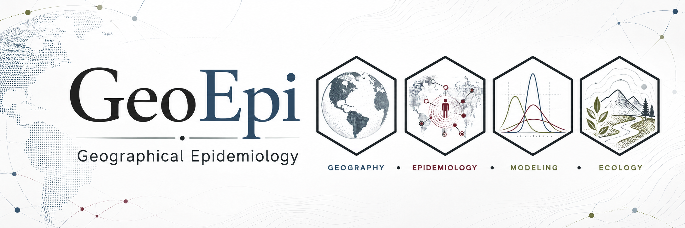

  

 

# GeoEpi

**Geographical Epidemiology Research Group**

GeoEpi studies the ecology, transmission, spread, and management of animal
diseases using spatial epidemiology, statistical and mathematical modeling,
bioinformatics, simulation, and computational science.

Our research spans molecular to landscape scales and focuses on foreign,
transboundary, emerging, and zoonotic animal diseases.

## Start here

| Resource | Purpose |
|---|---|
| **[GeoEpi Research Group](https://geoepi.github.io/)** | **Who we are** — research areas, people, projects, publications, and scientific products |
| **[GeoEpi Hub](https://github.com/geoepi/geoepi-hub)** | **What we are working on** — projects, analytical subprojects, milestones, data stewardship, and portfolio status |
| **[GeoEpi Lab Book](https://geoepi.github.io/geoepi-notebook/)** | **How we work** — practical guidance for organizing, documenting, computing, collaborating, and conducting reproducible research |

## What we do

GeoEpi develops and applies quantitative approaches to understand animal
disease systems across space, time, hosts, pathogens, and environments.

Our work includes:

- spatial and spatiotemporal epidemiology;
- statistical and Bayesian modeling;
- mathematical and simulation modeling;
- disease spread and risk assessment;
- bioinformatics, genomics, and phylogenetics;
- ecological and environmental modeling;
- scientific software and reproducible analytical workflows; and
- large-scale computational analysis.

Projects range from methodological research and software development to
operational analyses supporting animal health decision making.

## Research infrastructure

Scientific code and reproducible analytical workflows are maintained in
repositories within the **[GeoEpi GitHub organization](https://github.com/geoepi)**
and, where appropriate, collaborator-owned canonical repositories.

Large-scale computation and approved data processing are performed using
appropriate research computing infrastructure, including **Atlas and Ceres**.

Research products, archived materials, data, and collaborative resources may
also be maintained through platforms such as the
**[GeoEpi Open Science Framework](https://osf.io/hf8t2/)** and other appropriate
repositories.

## For group members and collaborators

**New to GeoEpi?** Start with the
**[GeoEpi Lab Book](https://geoepi.github.io/geoepi-notebook/)**.

**Looking for a project or analytical repository?** Start with the
**[GeoEpi Hub](https://github.com/geoepi/geoepi-hub)**.

**Looking for information about the research group and its scientific work?**
Visit the **[GeoEpi Research Group website](https://geoepi.github.io/)**.

---

**Website = who we are · Hub = what we are working on · Lab Book = how we work**